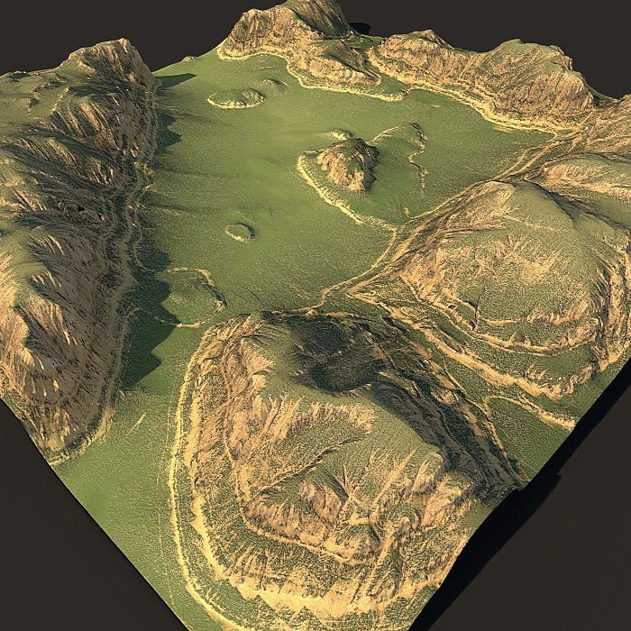
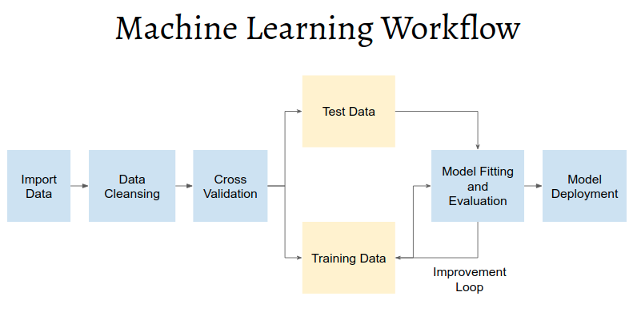
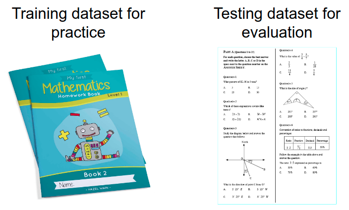
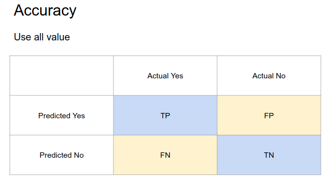
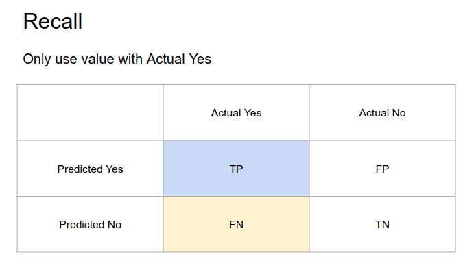
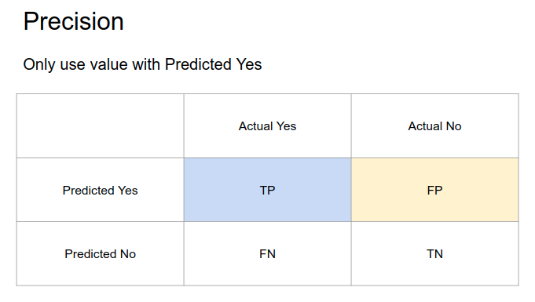

```{r setup, include=FALSE}
knitr::opts_chunk$set(echo = F,
                      message = F,
                      warning = F,
                      fig.align = "center",
                      out.width = "100%")
```

```{r message=FALSE, echo=FALSE}
# Data Wrangling
library(tidyverse)

# Model Fitting and Evaluation
library(rsample)
library(randomForest)
library(yardstick)
library(rpart)

# Visualization
library(scales)
library(ggrepel)
library(rattle)

source("helper.R")

options(scipen = 999)

theme_set(theme_minimal())
```

\newpage

We will see how CRISP-DM applied in a business case study of increasing product sales by building a model to predict potential customers.

```{r echo=FALSE, out.width="75%"}
knitr::include_graphics("assets/crisp-dm.png")
```

# Business Understanding

## Background

Our company sold an automotive product for over 20 years. However, for the last 5 years the monthly average profit has been constant and did not gain any significant growth since the number of sales are remain stagnant as well. The condition will remain the same in the future if we do not do something. We have a lot of customer leads that can be a potential buyer. However, with limited member of sales team, we don't have enough resource to approach more customer. It would be very inefficient and wasting a lot of resource to target all the leads. We want to be efficient instead of keep expanding the team, so we need another approach. With limited time and resources, we need to be able to quickly inspect and prioritize which customer is a potential buyer. We will also need to formally research on what makes them buy our products. By doing this, we can achieve higher or the same amount of profit with cheaper cost. 

```{r} 
df_rec <- read.csv("data/monthly_sales.csv")

# get mean sales
mean_profit <- mean(df_rec$sales)

df_rec %>% 
  mutate(date = as.Date(date)) %>% 
  ggplot(aes(date, sales, color = type, group = 1)) +
  geom_line() +  
  geom_hline(yintercept = mean_profit, lty = "dashed", color = "red", alpha = 0.7) +
  geom_point(size = 1) +
  scale_color_manual(values = c("firebrick", "dodgerblue4")) +
  scale_x_date(date_breaks = "1 year", date_labels = "%Y") +
  scale_y_continuous(labels = number_format(big.mark = ","),
                     limits = c(0, 15*1e4)) +
  theme(panel.grid.minor = element_blank(),
        legend.position = "top") +
  labs(x = NULL, y = "Total Profit", color = NULL,
       subtitle = paste0("Average Profit : ", dollar(mean(df_rec$sales))),
       title = "Monthly Profit")

```

In summary, our business problem is:

* We have stagnant profit because the number of sales is constant
* There are a lot of customer leads but we can't reach all of them
* We need to know which customer leads that should be prioritized
* We need lead scoring so that we can be efficent on targeting potential buyer

## Business Goals and KPI

The business goal is determined together with other department. This part should be the continuation of the background problem.

* Gain insight on what drives people to buy our product
* Increase profit by 10% year over year
* Reduce annual marketing cost by 10%

## Data Mining Goals and KPI

The data mining goal is determined by the data mining team and is a translation from the business goals.

* Build predictive model with 75% accuracy
* Build predictive model with 75% recall
* Build predictive model with 75% precision

# Data Understanding

On the **Data Understanding** phase, we will gather, describe and explore the data to make sure it fits the business goal.

The deliverable or result of this phase should include:

* Data description
* Early data exploration report
* Data quality report

## Gathering and Describing Data

Data are collected from the sales department in tabular format. The data consists of the past sales team interaction with the lead customer. The sales team keep record on whether the leads turn into purchase or refuse to buy the product, complete with the customer demographic information.

Here are some samples of the data.

```{r}
df_sales <- read.csv("data/sales.csv")

head(df_sales, 10)
```

We can also see try to get the information about the structure of the data including:

- The number of rows (each row represent a single customer data)
- The number of column
- The name of each column
- The data type of each column

```{r}
glimpse(df_sales)
```

The collected data consists of 40,000 distinct customers with 14 variables. The description of each column/variable can be seen below:

* **flag** : Whether the customer has bought the target product or not
* **gender** : Gender of the customer
* **education** : Education background of customer
* **house_val** : Value of the residence the customer lives in
* **age** : Age of the customer by group
* **online** : Whether the customer had online shopping experience or not
* **customer_psy** : Variable describing consumer psychology based on the area of residence
* **marriage** : Marriage status of the customer
* **children** : Whether the customer has children or not
* **occupation** : Career information of the customer
* **mortgage** : Housing Loan Information of customers
* **house_own** : Whether the customer owns a house or not
* **region** : Information on the area in which the customer are located
* **fam_income** : Family income Information of the customer(A means the lowest, and L means the highest)

## Early Data Exporation and Data Quality Check

We also need to check the quality of the data. For example, since many of the column/variable is categorical, we can check the summary of the data and see the number of customer of each categories. By doing this, we can also check whether there are any data that need to be cleansed or to be transformed. For example, we can check if there is a missing/empty values.

The text above each section is the name of the column in the data. The text on the left side is the category on each column while the number on the right side is the frequency of each category. Numerical variable will be presented in summary statistics (mean, median, min, max, etc.).

```{r}
summary(df_sales %>% mutate_if(is.character, as.factor))
```

We can check the full summary for `customer_psy` and `fam_income` column since they contain many categories.

```{r}
table("Customer Psychology" = df_sales$customer_psy)
```

```{r}
table("Family Income" = df_sales$fam_income)
```

There are some interesting finding from the summary. For example, the `gender` column consists of 3 categories: F (Female), M (Male), and U (Unknown). The `child` column is similar, with additional value of U (Unknown) and 0 (zero) even though the column should only be Yes or No. The `marriage` and `education` column contain empty values. This is not surprising, since the sales team are not instructed to fulfill each column with pre-determined values. However, this means that the incoming data quality is not good and require future standardization in the future. This also show us that we need to cleanse and prepare the data before we do any analysis so that all relevant information can be captured.

# Data Preparation

On the **Data Understanding** phase, we will prepare and cleanse the data so they are fit for analysis and making prediction. Some people said that the data preparation take 80% of the data mining process.

The deliverable or result of this phase should include:

* Data preparation steps
* Final data for modeling

## Data Cleansing

On this process, we handle the data based on the problem we find during the data understanding phase. Based on our finding, we will do the following process:

* Change missing/empty value in `education`, `house_owner` and `marriage` into explicit Unknown
* Make all *U* value in all categorical column into explicit Unknown
* Cleanse the `age` category by removing the index (1_Unkn into Unknown, 2_<=25 into <=25, etc.)
* Cleanse the `mortgage` category by removing the index

```{r}
df_clean <- df_sales %>% 
  mutate(
    flag = ifelse(flag == "Y", "Yes", "No"),
    gender = case_when(gender == "F" ~ "Female",
                       gender == "M" ~ "Male",
                       TRUE ~ "Unknown"),    
    child = case_when(child == "Y" ~ "Yes",
                      child == "N" ~ "No",
                      TRUE ~ "Unknown"),    
    education = str_remove_all(education, "[0-9.]") %>% 
      str_trim(),
    education = ifelse(education == "", "Unknown", education),
    age = substr(age, 3, nchar(age)),
    age = ifelse(age == "Unk", "Unknown", age),
    age = case_when(age == "<=35" ~ "26-35",
                    age == "<=45" ~ "36-45",
                    age == "<=55" ~ "46-55",
                    age == "<=65" ~ "56-65",
                    TRUE ~ age
                    ),
    fam_income = ifelse(fam_income == "U", "Unknown", fam_income),
    customer_psy = ifelse(customer_psy == "U", "Unknown", customer_psy),
    online = ifelse(online == "Y", "Yes", "No"),
    marriage = ifelse(marriage == "", "Unknown", marriage),
    mortgage = substr(mortgage, 2, nchar(mortgage)),
    house_owner = ifelse(house_owner == "", "Unknown", house_owner)
  )

summary(df_clean %>% mutate_if(is.character, as.factor))
```

Now that the data is already cleansed, we need to consider whether we need to remove data that contain any *Unknown* value? Should the sales team need to know all information about a customer to make a prediction or are they allowed to fill some variable with Unknown? In this step we need to discuss with the sales team since they are the final user of the model.

Let's say together with the sales team we have decided that any data that contain missing value should not be used for analysis Therefore, we will drop/remove any row/customer that has missing information about them. 

Finally, after careful and rigorous data cleansing, we acquire our final data that will be used for analysis and modeling.

## Final Data

```{r}
df_clean <- df_clean %>% 
  mutate_all(function(x) ifelse(x == "Unknown", NA, x)) %>% 
  drop_na() %>% 
  mutate_if(is.character, as.factor) %>% 
  mutate(
    flag = factor(flag, levels = c("Yes", "No"))
         )

head(df_clean, 10)
```

# Data Understanding (Again)

As expected, CRISP-DM is not a linear process. We can go back and forth between process to make sure it fits the business and data mining goal. Here, we go back to data understanding phase to further explore and analyze the data before we start to make a machine learning model.

## Exploratory Data Analysis

The process of exploring and visualizing insight from the data is called **Exploratory Data Analysis (EDA)**.

### House Valuation Distribution

Here we will do visualization to see whether there are any difference between customer who buy our product and who don't. To visualize a distribution, we can use histogram. The *x-axis* is the house valuation while the *y-axis* show the frequency or the number of customer with certain house valuation.

From the histogram, most of our customer has house valuation less than 2,500,000. Some customers are outlier and has house valuation greater than 2,500,000. Their frequency is low and they cannot be seen on the histogram. The distribution for people who buy and not buy are quite similar, therefore we cannot simply decide if a customer will buy our product based on their house valuation.

```{r}
df_clean %>% 
  ggplot(aes(x = house_val, fill = flag)) +
  geom_histogram(color = "white", alpha = 0.75) +
  theme(legend.position = "top") +
  scale_x_continuous(labels = number_format(big.mark = ",")) +
  scale_y_continuous(labels = number_format(big.mark = ",")) +
  labs(x = "House Valuation", y = "Frequency",
       fill = "Flag",
       title = "House Valuation Distribution")
```

We can cut and remove the outlier to see the distribution better.

```{r}
df_clean %>% 
  ggplot(aes(x = house_val, fill = flag)) +
  geom_histogram(color = "white", alpha = 0.75) +
  theme(legend.position = "top") +
  scale_x_continuous(labels = number_format(big.mark = ","), limits = c(0, 2*1e6)) +
  scale_y_continuous(labels = number_format(big.mark = ",")) +
  labs(x = "House Valuation", y = "Frequency",
       fill = "Flag",
       title = "House Valuation Distribution")
```

### Education Level

We will see if the education level can be a great indicator to decide if a customer has high probability to buy our product. The color of each block represent the frequency of people that fell in that category, with brighter color indicate higher frequency. 

Based on the heatmap, people with higher education level (*Bach* and *Grad*) are more likely to buy our product. Therefore, education level may be a great indicator to check potential customer.

```{r}
df_clean %>% 
  count(flag, education) %>% 
  ggplot(aes(education, flag, fill = n)) +
  geom_tile(color = "white") +
  geom_text(aes(label = number(n, big.mark = ","))) +
  scale_fill_binned(low = "firebrick", high = "lightyellow",
                    label = number_format(big.mark = ",")) +
  theme(legend.position = "top",
        legend.key.width = unit(15, "mm")) +
  labs(x = "Education", 
       y = "Flag", 
       fill = "Frequency")
```

### Occupation

We will do the same thing here with the occupation/job. The one that stands out is the professional occupation that has a very high frequency of people who buy our product.

```{r}
df_clean %>% 
  count(flag, occupation) %>% 
  ggplot(aes(occupation, flag, fill = n)) +
  geom_tile(color = "white") +
  geom_text(aes(label = number(n, big.mark = ","))) +
  scale_fill_binned(low = "firebrick", high = "lightyellow",
                    label = number_format(big.mark = ",")) +
  theme(legend.position = "top",
        legend.key.width = unit(15, "mm")) +
  labs(x = "Occupation", 
       y = "Flag", 
       fill = "Frequency")
```

You can keep doing exploratory with other variables and with different approach. The point of EDA is to make understand more about the data and finding new insight before making a predictive model.

# Modeling

On the **Modeling** phase, we will start creating model to find pattern inside our data and to make future prediction for business purpose.

The deliverable or result of this phase should include:

* Modeling Technique and assumption
* Model Description
* Model Evaluation

## Model and Machine Learning

A model is a representation of the world. Since it's just a representation, some information may lost and not very accurate. However, the model still useful for some purpose.

> All models are wrong, but some are useful. - George Box

```{r out.width="80%"}

```

Machine learning is a statistical model that is specifically designed to learn and find pattern from a data. The data that is used to train the model is called the **Training Dataset**. Depending on their purpose, they can be divided into several categories:

* **Supervised Learning**: Model learn and being supervised. There is a target variable, a variable we want to predict. Imagine the model as a student who learn from a data, then they need to make a prediction. If the model is wrong, it will try to correct itself until the error is minimum.

   - **Regression problem** is where we want to predict a numerical variable, such as a house price, car price, energy consumption, etc.
   - **Classification problem** is where we want to predict a categorical variable, such as the probability of a customer to churn, detecting cancer cell from image, credit scoring, etc.

* **Unsupervised Learning**: There is no target variable. Model is free to find its own pattern.
* **Reinforcement Learning**: Model learn by interacting with the environment. The model often used for simulation and decision making.

Below is some application of each respective category of machine learning, with no specific machine learning algorithm being mentioned.

```{r out.width="80%"}
knitr::include_graphics("assets/ml-type.png")
```

Machine learning is part of the data mining process. However, we will illustrate the general machine learning workflow with this simple figure.

```{r}

```

The import data and the data cleansing is the same process as before. The next step for building a model is to do a process called Cross-Validation.

## Cross-Validation

The cross-validation step is where we will split our data into 2 separate dataset: training dataset and testing dataset.

* **Training Dataset**: Dataset that will be used to train the machine learning model
* **Testing Dataset**: Dataset that will be used to evaluate the performance of the model.

Why do we need to separate the data? Because the model will always perform better in the data that they've trained with. Imagine where you are doing a math homework. You can easily do them, especially after you check the correct answer and learn what makes you wrong. However, we want our model to be able to predict a new, unseen data. That's why we need the testing dataset. The testing dataset acts as the examination or evaluation for the model, to check whether they can truly learn the pattern inside the data.

```{r out.width="80%"}

```

Here we split the data with 80% of the data will be the training dataset and the rest will be the testing dataset. Each observation/row is randomly selected as either the training set or the testing set. The random selection is done to make sure we don't include any selection bias done by human.

The data train consists of 13,279 rows while the data test consists only of 3,318 rows.

```{r}
set.seed(123)
index <- initial_split(df_clean, prop = 0.8, strata = "flag")

data_train <- training(index)
data_test <- testing(index)

cat("Number of Data Train : ", nrow(data_train),"\n")
cat("Number of Data Test : ", nrow(data_test))
```

## Model Fitting

Here, we fit or train the model using the data train. We will use 2 different models: Decision Tree and Random Forest. Later, we will evaluate both models and choose only the best model.

### Decision Tree

The decision tree is a machine learning algorithm that try to create a set of rule to classify and predict the target variable. The model tries to split the data into homogeneous group based on the predictor variable.

You can see from the figure below that decision tree is like a flow chart that we can actually follow. For example, if the customer psychology is either A, B, C, or E, then there is a high chance that the customer will buy our product. If the customer don't belong in those customer psychology, we then proceed to check whether the customer had any previous online experience. If he/she never had any online experience, then it is more likely that the customer will not buy our product. The higher variable has higher importance in determining customer's buying decision. By understanding which factors are important, we can provide better service and promotion for customer to increase the chance of conversion.

```{r}
model_tree <- rpart(flag ~., data_train)

fancyRpartPlot(model_tree, sub = NULL, main = "Predictive Rule from Decision Tree\n")
```

### Random Forest

The next model is Random Forest. In short, Random Forest is a collection of decision tree that together make a single decision. Imagine you are in a middle of a presidential election and as a country you need to decide which presidential candidate to choose. Each citizen is a single decision tree with their own prediction. Together, they decide which candidate that will be elected and the final decision is the majority voting. Random Forest is more powerful than Decision Tree due to this characteristics.

However, we can't get a nice plot of flowchart like the previous decision tree. Instead, we can only get the importance of each variable based on a certain metric called *Gini Index*. According to the Random Forest, the most important variable to predict customer's buying decision is the `house valuation`, followed by the `family income` and `customer psychology`.

```{r}
model_rf <- randomForest(flag ~ ., data = data_train,
                         ntree = 500,
                         nodesize = 1,
                         mtry = 2,
                         importance = T
                         )

model_rf$importance %>% 
  as.data.frame() %>% 
  rownames_to_column("var") %>% 
  ggplot(aes(x = MeanDecreaseGini,
             fill = MeanDecreaseGini,
             y = var %>% reorder(MeanDecreaseGini))) +
  geom_col() +
  scale_fill_binned(low = "firebrick", high = "lightyellow")+
  labs(x = "Gini Decrease",
       fill = "Gini Decrease",
       y = "Predictors",
       title = "Variable Importance")
```

Now that we understand and describe the model, we need to evaluate them and see if they are actually able to distinguish customer that buy our product.

## Model Evaluation

In classification problem, we evaluate model by looking at how many of their predictions are correct. This can be plotted into something called **Confusion Matrix**.

```{r out.width="80%"}
knitr::include_graphics("assets/confusion-matrix.png")
```

The matrix is divided into four area:

* **True Positive (TP)**: The model predict customer **will buy** and the prediction is correct (customer buy)
* **False Positive (FP)**: The model predict customer **will buy** and the prediction is incorrect (customer not buy)
* **True Negative (TN)**: The model predict customer **will not buy** and the prediction is correct (customer not buy)
* **False Negative (FN)**: The model predict customer **will not buy** and the prediction is incorrect (customer buy)

For example, here is the confusion matrix from the decision tree after doing prediction to the testing dataset.

```{r}
pred_test <- predict(model_tree, data_test, type = "class")
pred_prob <- predict(model_tree, data_test, type = "prob")

df_prediction_tree <- as.data.frame(pred_prob) %>% 
  mutate(prediction = pred_test,
         truth = data_test$flag) 

conf_mat(df_prediction_tree, truth = truth, estimate = prediction)
```

If we define positive as Yes:

* **True Positive (TP)**: 1648
* **False Positive (FP)**: 791
* **True Negative (TN)**: 581
* **False Negative (FN)**: 298

Next, we can start doing evaluation using 3 different metrics: accuracy, recall, and precision. Those metrics are pretty general and complement each other. There are more evaluation metrics but we will not be discussed it here.

* **Accuracy**

Accuracy simply tell us how many prediction is true compared to the total dataset.

```{r out.width="80%"}

```

$$
Accuracy = \frac{TP + TN}{TP + TN + FP + FN}
$$

```{r echo=TRUE}
(1648 + 581) / (1648 + 581 + 791 + 298)
```

From all data in testing dataset, only 67% of them are correctly predicted as buy/not buy.

$$
Accuracy = \frac{1648 + 581}{1648 + 581 + 791 + 298} = 0.67179 = 67.18\%
$$

* **Sensitivity/Recall**

Recall/sensitivity only concerns how many customers that actually buy can correctly be predicted. The metric don't care about the customer that don't actually buy our product.

```{r out.width="80%"}

```

$$
Recall = \frac{TP}{TP + FN}
$$

```{r echo=TRUE}
1648 / (1648 + 298)
```

From all customer that actually buy our product, 84% of them are correctly predicted as buy and 16% as not buy.

$$
Recall = \frac{1648}{1648 + 298} = 0.8468 = 84.68\%
$$

* **Precision**

Precision only concern on how many positive prediction that are actually correct. The metric don't care about customer that is predicted not buy.

```{r out.width="80%"}

```

$$
Precision = \frac{TP}{TP + FP}
$$

```{r echo=TRUE}
1648 / (1648 + 791)
```

From all customer that is predicted to buy, only 67% of them that are actually buy our product.

$$
Precision = \frac{1648}{1648 + 791} = 0.67568 = 67.57\%
$$

### Decision Tree

Here is the recap of the evaluation metrics for Decision Tree.

```{r}
evaluate_model(df_prediction_tree)
```

### Random Forest

Here is the recap of the evaluation metrics for Random Forest. The model is slightly better than the Decision Tree. 

```{r}
pred_test <- predict(model_rf, data_test)
pred_prob <- predict(model_rf, data_test, type = "prob")

df_prediction_rf <- as.data.frame(pred_prob) %>% 
  mutate(prediction = pred_test,
         truth = data_test$flag)

evaluate_model(df_prediction_rf)
```

With that, we can go back to the business goal, specifically the **Data Mining Goals** of our project. Does our model have achieved our data mining goals?

* Build predictive model with 75% accuracy
* Build predictive model with 75% recall
* Build predictive model with 75% precision

If the model doesn't satisfy the data mining goals, the team can works on improving the model to get better performance. That's why we have an improvement loop on the machine learning workflow. We rarely achieve our best model on the first run and need to do several iterations on improvement until we find the best model.

For now, we will proceed to the next step.

# Evaluation 

On the **Evaluation** phase, we will further evaluate the model into the context of the business problem.

The deliverable or result of this phase should include:

* Model business assesment
* Review of the overal process
* Possible action and final decision

## Cost and Benefit Analysis

The cost and benefit analysis is where we try to convert the machine learning performance into the business context. We will try to see by employing the machine model, how many profit that we can make compared to the average profit we currently have?

### Define Cost and Benefit

The first we do is to define the cost and benefit of each decision. We will define it similar with the previous confusion matrix. The main cost is the cost of approaching a customer, in here we defined it as 600. The revenue generated for each customer is 1000, with the profit of 400 after we cut the revenue with the cost. 

* **True Positive (TP)**: If the model predict customer **will buy** and the prediction is correct **(customer actually buy)**, we will get a profit of 400 (1000 revenue - 600 cost)
* **False Positive (FP)**: If the model predict customer **will buy** and the prediction is incorrect **(customer not buy)**, we will lost 600 
* **True Negative (TN)**: If the model predict customer **will not buy** and the prediction is correct **(customer not buy)**, nothing happened
* **False Negative (FN)**: If the model predict customer **will not buy** and the prediction is incorrect **(customer buy)**, nothing happened

```{r}
# Define cost and benefit
b_pos <- 400 # benefit if positive prediction is correct
b_neg <- 0    # benefit if negative prediction is correct
c_pos <- -600  # cost if positive prediction is incorrect
c_neg <- 0  # cost if negative prediction is incorrect

data.frame("Benefit True Positive" = b_pos,
           "Benefit True Negative" = b_neg,
           "Cost False Positive" = c_pos,
           "Cost False Negative" = c_neg, 
           check.names = F
           )
```

### Profit Curve

We will prioritize the customer that has the highest probability to buy our product. Thus, first we make a list of a high scoring customer.

```{r}
df_prediction_rf %>% 
  arrange(desc(Yes)) %>% 
  select(-prediction) %>% 
  head(10)
```

And we calculate for how many profit we will get if we target and approach only some percent of the total customer? For example, if we only target the top 10 customer and ignore the rest, we have correctly predict 8 customer as buy and only a single incorrect prediction (the actual buying decision is on the `truth` column). Thus, our profit would be: 

$$
Profit = 8 \times 400 + 2\times (-600) = 2000
$$

Since we have 0 cost and 0 benefit for negative prediction, we can skip the calculation and our final profit is only a mere 2000.

Now we increase the number of people that we will approach by using the top 20 leads based on their score.

```{r}
df_prediction_rf %>% 
  arrange(desc(Yes)) %>% 
  select(-prediction) %>% 
  head(20)
```

From the top 20 leads, we get 18 correct prediction of buying and 2 incorrect prediction. Therefore, we will get a total profit of:

$$
Profit = 18 \times 400 + 2\times (-600) = 6000
$$

That's how we will calculate the profit. We will do the same thing but calculate some level of percent of people that will be targeted. The final result is the following profit curve, which shows the total profit that can be generated by targeting the top % of the customer.

```{r}
percent_look <- seq(0, 1, 0.01)

df_profit <- data.frame(percent = percent_look) %>% 
  mutate(top_n = round(nrow(data_test) * percent)) %>%
  bind_cols(map_df(percent_look, profit_class)) %>% 
  mutate("Random Classifier" = NA) %>% 
  pivot_longer(cols = c(3:5), names_to = "model", values_to = "profit")
```


```{r}
lm_random <- lm(profit ~ percent, data.frame(profit = c(df_profit %>% filter(percent ==0) %>% pull(profit) %>% .[1], df_profit %>% filter(percent ==1) %>% pull(profit) %>% .[1]),
                                             percent = c(0, 1)
                                             ))

df_profit <- df_profit %>% 
  mutate(profit = ifelse(model == "Random Classifier", predict(lm_random, df_profit), profit))

# highest profit
df_high <- df_profit %>% 
  filter(profit == max(profit))

# highest profit at budget
df_limit <- df_profit %>% 
  filter(percent == 0.24) %>% 
  filter(profit == max(profit))

# budget increase
df_increase <- df_profit %>% 
  filter(percent %in% c(df_high$percent, df_limit$percent)) %>% 
  group_by(percent) %>% 
  mutate(increase = abs((max(profit) - mean_profit) /mean_profit),
         profit = ifelse(model == "Random Classifier", mean_profit, profit)) %>% 
  ungroup() %>% 
  filter(model %in% c("Random Classifier", "Random Forest"))
 
# visualize
df_profit %>% 
  ggplot(aes(percent, profit)) +
  geom_hline(yintercept = 0, lty = "dashed", color = "black", alpha = 0.5) +
  geom_hline(yintercept = mean_profit, lty = "dashed", color = "red", alpha = 0.7) +
  geom_path(data = df_increase, aes(x = percent, y = profit, group = percent), alpha = 0.5, lty = "dashed") +
  geom_line(aes(color = model)) +
  geom_text_repel(data = df_high, aes(label = paste0("Max Profit\n$ ", number(profit, big.mark = ','))), nudge_x = 0.25, nudge_y = 3*1e4, segment.alpha = 0.5) +
  geom_point(data = df_high, shape = 21, fill = "white", size = 2) +
  geom_text_repel(data = df_limit, aes(label = paste0("Max Profit\nat Budget\n$ ", number(profit, big.mark = ','))), nudge_x = -0.15, nudge_y = 5*1e4, segment.alpha = 0.5) +
  geom_point(data = df_limit, shape = 21, fill = "white", size = 2) +
  geom_text(data = df_increase %>% filter(model == "Random Classifier"), 
            aes(label = paste0(percent(increase, big.mark = ','), "\nIncrease")), 
            nudge_y = c(5*1e4, 10*1e4), nudge_x = 0.05) +
  geom_text(data = data.frame(), aes(x = 1, y = mean_profit, label = "Average\nProfit"), hjust = 1, nudge_y = 3*1e4) +
  theme(legend.position = "top", 
        panel.grid.minor = element_blank()) +
  scale_y_continuous(labels = number_format(big.mark = ","), 
                     breaks = c(0, seq(-5*1e4, 35*1e4, 10*1e4)), 
                     limits = c(-5*1e4, 35*1e4)) +
  scale_x_continuous(labels = percent_format(accuracy = 1)) +
  scale_color_manual(values = c("firebrick", "gray30", "dodgerblue4")) +
  labs(title = "Profit Curves",
       subtitle = paste0("Highest profit: $ ", number(df_high$profit, big.mark = ','), " by targeting top ", percent(df_high$percent), " (", number(df_high$top_n, big.mark = ","), ")", " individuals"),
       x = "Percentage of Targeted Individuals (Decreasing by Score)",
       y = "Total Profit",
       color = "Model"
       )
```

The maximum profit that we can get is 262,400 by targeting the top 46% individuals using the score from Random Forest. Compared to the average profit we gain every month, this is a 186% increase. We also show you how many profit generated by random classifier, which is just a simple random guess (50:50 probability).

We can also add some scenarios. For example, the sales has only a monthly budget of 480,000. If each customer cost 600 to approach, we can only target 480,000/600 = 800 individuals = top 24% leads. In this scenario, we will get 177,400, which is still a big improvement from our average profit. The main focus of this profit curve is to show you that we don't need to approach all customer and prioritize the one that has the highest chance to buy our product.

If we change the cost and benefit value, the graph will also change. For example, let's say we have successfully cut the marketing cost by 50 from 600 to 550.

```{r}
# Define cost and benefit
b_pos <- 400 # benefit if positive prediction is correct
b_neg <- 0    # benefit if negative prediction is correct
c_pos <- -550  # cost if positive prediction is incorrect
c_neg <- 0  # cost if negative prediction is incorrect

data.frame("Benefit True Positive" = b_pos,
           "Benefit True Negative" = b_neg,
           "Cost False Positive" = c_pos,
           "Cost False Negative" = c_neg, 
           check.names = F
)
```


```{r}
percent_look <- seq(0, 1, 0.01)

df_profit <- data.frame(percent = percent_look) %>% 
  mutate(top_n = round(nrow(data_test) * percent)) %>%
  bind_cols(map_df(percent_look, profit_class)) %>% 
  mutate("Random Classifier" = NA) %>% 
  pivot_longer(cols = c(3:5), names_to = "model", values_to = "profit") 

lm_random <- lm(profit ~ percent, data.frame(profit = c(df_profit %>% filter(percent ==0) %>% pull(profit) %>% .[1], df_profit %>% filter(percent ==1) %>% pull(profit) %>% .[1]),
                                             percent = c(0, 1)
))

df_profit <- df_profit %>% 
  mutate(profit = ifelse(model == "Random Classifier", predict(lm_random, df_profit), profit))

# highest profit
df_high <- df_profit %>% 
  filter(profit == max(profit))

# highest profit at budget
df_limit <- df_profit %>% 
  filter(percent == 0.24) %>% 
  filter(profit == max(profit))

# budget increase
df_increase <- df_profit %>% 
  filter(percent %in% c(df_high$percent, df_limit$percent)) %>% 
  group_by(percent) %>% 
  mutate(increase = abs((max(profit) - mean_profit) / mean_profit),
         profit = ifelse(model == "Random Classifier", mean_profit, profit)) %>% 
  ungroup() %>% 
  filter(model %in% c("Random Classifier", "Random Forest"))

# visualize
df_profit %>% 
  ggplot(aes(percent, profit)) +
  geom_hline(yintercept = 0, lty = "dashed", color = "red", alpha = 0.7) +  
  geom_hline(yintercept = mean_profit, lty = "dashed", color = "red", alpha = 0.7) +
  geom_path(data = df_increase, aes(x = percent, y = profit, group = percent), alpha = 0.5, lty = "dashed") +
  geom_line(aes(color = model)) +
  geom_text_repel(data = df_high, aes(label = paste0("Max Profit\n$ ", number(profit, big.mark = ','))), nudge_x = 0.25, nudge_y = 3*1e4, segment.alpha = 0.5) +
  geom_point(data = df_high, shape = 21, fill = "white", size = 2) +
  geom_text_repel(data = df_limit, aes(label = paste0("Max Profit\nat Budget\n$ ", number(profit, big.mark = ','))), nudge_x = -0.15, nudge_y = 5*1e4, segment.alpha = 0.5) +
  geom_point(data = df_limit, shape = 21, fill = "white", size = 2) +
  geom_text(data = df_increase %>% filter(model == "Random Classifier"), 
            aes(label = paste0(percent(increase, big.mark = ','), "\nIncrease")), 
            nudge_y = c(5*1e4, 12*1e4), nudge_x = 0.05) +
  geom_text(data = data.frame(), aes(x = 1.05, y = mean_profit, label = "Average\nProfit"), hjust = 1, nudge_y = 3*1e4) +
  theme(legend.position = "top", 
        panel.grid.minor = element_blank()) +
  scale_y_continuous(labels = number_format(big.mark = ","),
                     breaks = seq(-5*1e4, 60*1e4, 5*1e4),
                     limits = c(-5*1e4, 35*1e4)) +
  scale_x_continuous(labels = percent_format(accuracy = 1)) +
  scale_color_manual(values = c("firebrick", "gray30", "dodgerblue4")) +
  labs(title = "Profit Curves",
       subtitle = paste0("Highest profit: $ ", number(df_high$profit, big.mark = ','), " by targeting top ", percent(df_high$percent), " individuals"),
       x = "Percentage of Targeted Individuals (Decreasing by Score)",
       y = "Total Profit",
       color = "Model"
  )
```

## Review Overal Process

The overal process of the data mining is quite smooth with some flaws that we find:

* Dirty or improper input data 
* Underperforming model
* Data gathering is not done in real time yet

## Final Decision

After reviewing the project, there are some possible action for us to do:

* Improve the model before release them into the real use
* Release the model while also developing a better model
* Create a standardized data input procedure
* Present a full report of the data mining project

# Deployment

Deployment is where data mining pays off. It doesn’t matter how brilliant your discoveries may be, or how perfectly your models fit the data, if you don’t actually use those things to improve the way that you do business. We have build the model but how do we use them in real life situation? We can launch the model in several ways. The common method to release a machine learning model into production/real use case is as follows:

* [Building a dashboard](https://argaadya.shinyapps.io/customer-targeting/)
* [Building an API](https://juan0001.github.io/how-to-deploy-machine-learning-model-overview/)

The deliverable or result of this phase should include:

* Deployment plan
* Monitoring and Maintenance
* Final Report

# Conclusion

The CRISP-DM methodology is a long and detailed standard that will make your data mining project fits your business needs and documented properly. Its not a linear method, you can always go back to the previous step if you found an issue or need to renew some goals and process.