```{r setup, include=FALSE}
knitr::opts_chunk$set(echo = F, message = F, warning = F)
```


# A World Full of Data

---


[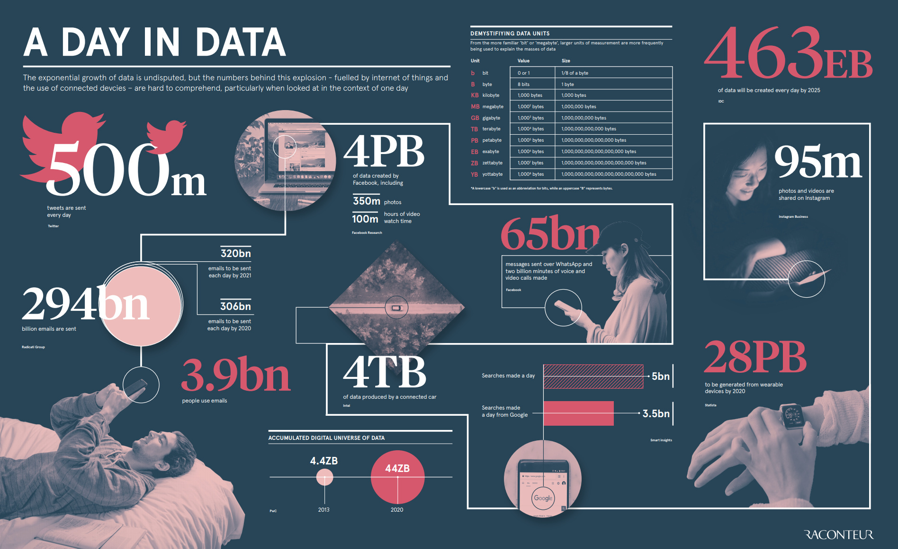{ height=650px }](https://www.weforum.org/agenda/2019/04/how-much-data-is-generated-each-day-cf4bddf29f/)

---

So much data can be collected along the way

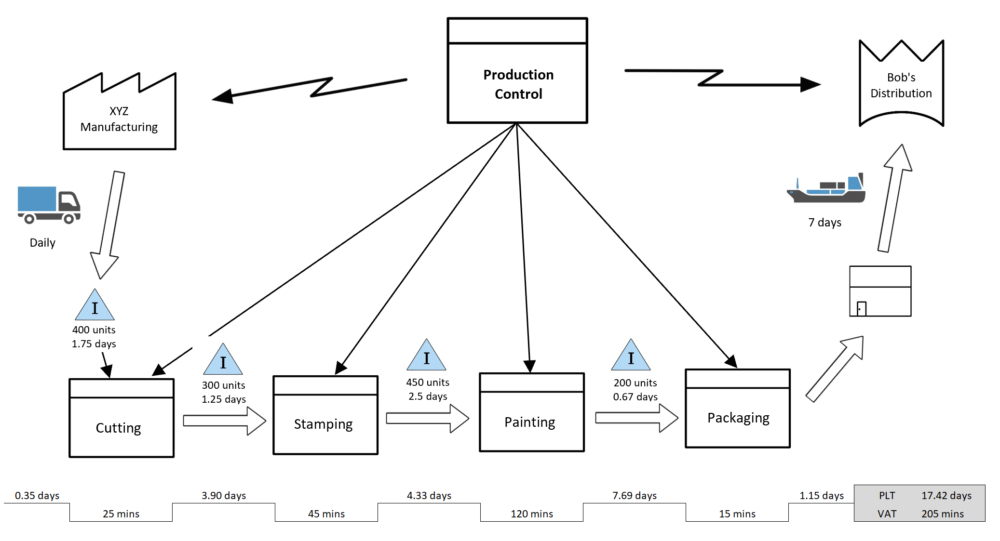{ height=600px } 

## Knowledge Discovery from Data

<small> Data mining is the process of discovering interesting patterns and knowledge from large amounts of data (Han et al., 2012) </small>

<div class="container">
<div class="col">

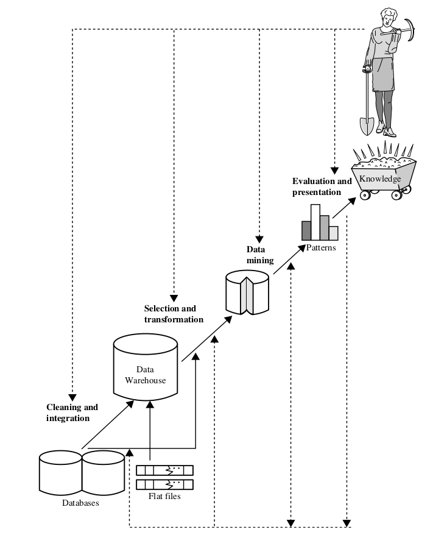{ height=500px}

</div>
<div class="col">

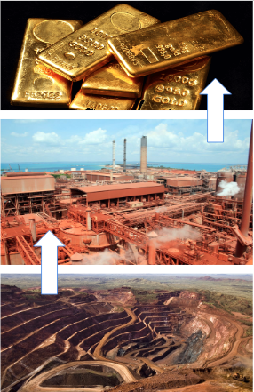{ height=500px}

</div>


## Utilizing Data

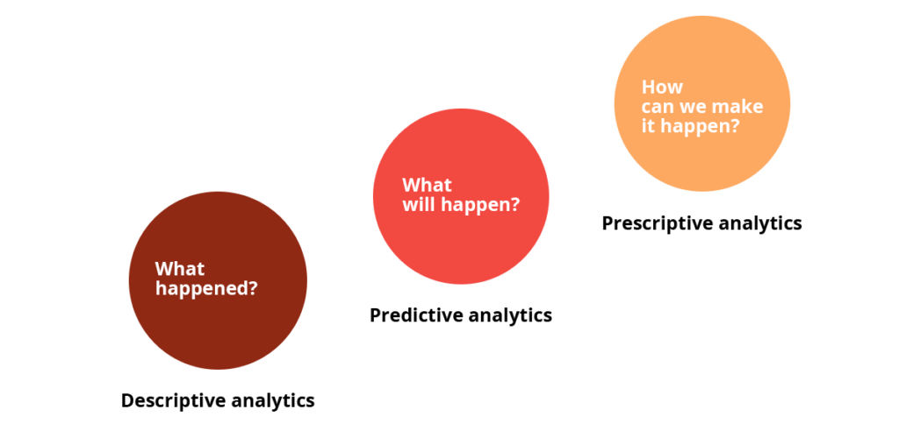


---

Global Covid-19 Projections

[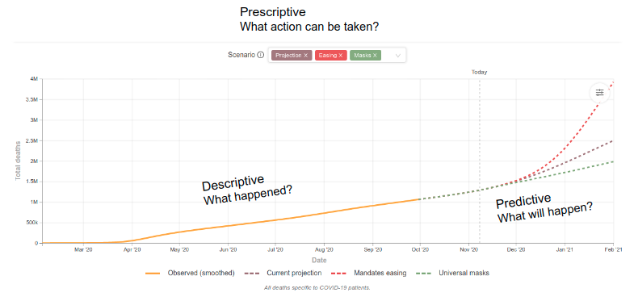{ height=500px}](https://covid19.healthdata.org/global?view=total-deaths&tab=trend)

---


---

<div class="container">

<div class="col">

**Descriptive Analytics**

<small>

* How much sales generated last month?
* What is the top product sold?
* What is the least profitable product?
* What is the average spending of a customer?

</small>
</div>

<div class="col_sep">

</div>

<div class="col">

**Predictive Analytics**

<small>

* How many demand for product *X* in the next 6 months?
* What drives the customer to buy more products?
* If customer buy product *Y*, what other items that most likely will be bought?
* Will customer *A* churn to the competitor?

</small>

</div>

<div class="col_sep">

</div>

<div class="col">

**Prescriptive Analytics**

<small>

* What is the best discount value to increase sales for product *X*?
* What is the best route to reduce cost of deliveries?
* What can be done to reduce the customer churn?

</small>

</div>

</div>

## Other Use Case

[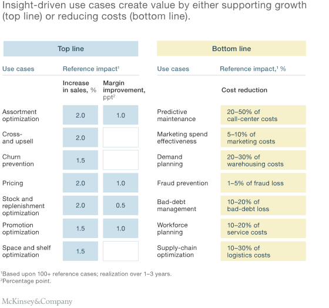](https://www.mckinsey.com/business-functions/mckinsey-analytics/our-insights/achieving-business-impact-with-data#)


# CRISP-DM Methodology

---

Cross-Industry Standard Process for Data Mining

{ height=500px }

<small> Click <a href="ftp://ftp.software.ibm.com/software/analytics/spss/support/Modeler/Documentation/14/UserManual/CRISP-DM.pdf"> here </a>  to see the official document </small>

## Business Understanding

<small> Define what you want to accomplish and define the reasons for wanting to achieve this goal. </small>

**Deliverable**
<small>

* Background/Business Problem
* Business Goals and KPI
* Data Mining Goals and KPI

</small>

{height=150px}

## Data Understanding

<small> Gather, describe and explore the data to make sure it fits the business goal  </small>

**Deliverable**
<small>

* Data Description
* Data Exploration Report
* Data Quality Report

</small>

{height=150px}

## Data Preparation

<small> Preparing data for further analysis  </small>

**Deliverable**
<small>

* Data Preparation Steps
* Final Data for Modeling

</small>

{height=150px}

## Modeling

<small> Finding pattern and do prediction  </small>

**Deliverable**
<small>

* Modeling Technique and Assumption
* Model Description
* Model Evaluation

</small>

{height=150px}

## Evaluation

<small> Does the model solve the business problem?  </small>

**Deliverable**
<small>

* Model business assessment
* Review of the overall process
* Possible action and final decision

</small>

{height=150px}

## Deployment

<small> Release the model into production  </small>

**Deliverable**
<small>

* Deployment plan
* Monitoring and Maintenance
* Final Report

</small>

{height=150px}

# Tools

## Common Tools for Data Mining

<div class="container">

<div class="col">

[{ height=130px }](https://www.r-project.org/)

</div>

<div class="col">

[{ height=150px }](http://rstudio.com/)

</div>

<div class="col">

[{ height=150px }](https://www.python.org/)

</div>

<div class="col">

[{ height=150px }](https://www.anaconda.com/)

</div>

<div class="col">

[{ height=150px}](https://www.cs.waikato.ac.nz/ml/weka/)

</div>


</div>

<div class="container">

<div class="col">

[{ height=75px }](https://www.sas.com/)

</div>

<div class="col">

[{ height=75px }](https://www.stata.com/)

</div>

<div class="col">

[{ height=75px }](https://www.tableau.com/)

</div>

</div>


<div class="container">

<div class = "col">

[{ height=150px width=350px}](https://rapidminer.com/)

</div>

<div class = "col">

[{ height=125px width=350px }](https://www.knime.com/)

</div>

<div class = "col">

[{ height=120px}](https://orange.biolab.si/)

</div>

</div>

---

Survey from KDnuggets

[{ height=500px }](https://www.kdnuggets.com/2019/05/poll-top-data-science-machine-learning-platforms.html)


# Case Study 


Predictive Lead Scoring

{height=400px}

# External Resource

## Conceptual


<div class="container">

<div class="col">

[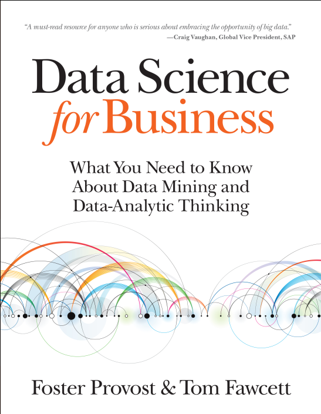{ height=400px }](https://www.amazon.com/Data-Science-Business-Data-Analytic-Thinking/dp/1449361323)

</div>

<div class="col">

[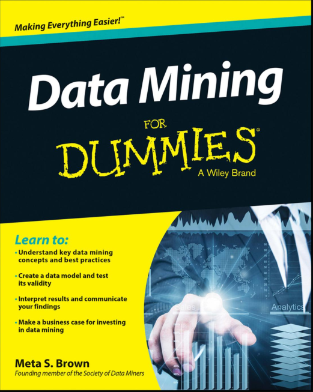{ height=400px }](https://www.dummies.com/programming/big-data/engineering/data-mining/)

</div>

<div class="col">

[{ height=400px }](https://www.amazon.com/Weapons-Math-Destruction-Increases-Inequality/dp/0553418815)


</div>

<div class = "col">

[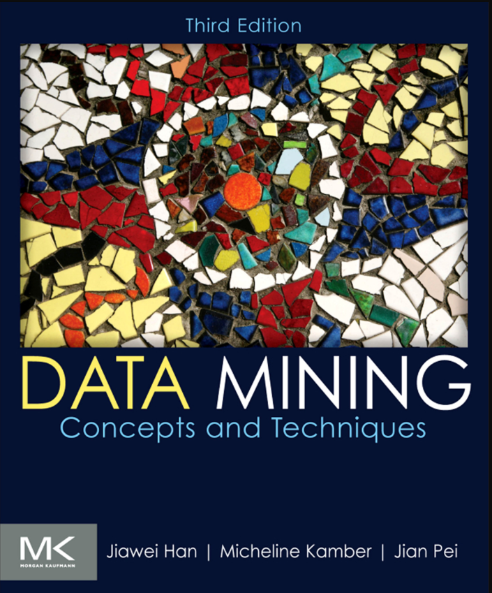{ height=400px }](https://www.amazon.com/Data-Mining-Concepts-Techniques-Management/dp/0123814790)

</div>

</div>

## Technical

<div class="container">

<div class="col">


[{ height=400px }](http://r4ds.had.co.nz/)

</div>

<div class="col">

[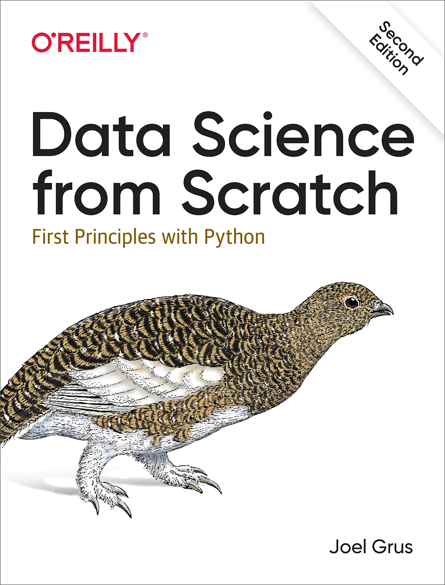{ height=400px }](https://www.oreilly.com/library/view/data-science-from/9781492041122/)

</div>

<div class="col">

[{ height=400px }](http://faculty.marshall.usc.edu/gareth-james/ISL/)

</div>

<div class="col">

[{ height=400px }](https://jakevdp.github.io/PythonDataScienceHandbook/)

</div>


</div>

# Reach Me Out

<div class="container">

<div class="col">

```{r out.height="100px", out.width="100px"}

```


<small> [Arga Adyatama](https://www.linkedin.com/in/arga-adyatama-59327a151/) </small>

</div>

<div class="col">

```{r out.height="125px", out.width="125px"}

```

<small> arga@algorit.ma </small>

</div>

<div class="col">

```{r out.height="100px", out.width="100px"}
knitr::include_graphics("assets/github.png")
```

<small> [github.com/Argaadya](http://github.com/Argaadya) </small>

</div>

</div>

----

Visit Algoritma Official Website

```{r out.height="200px", out.width="200px"}

```

[algorit.ma](http://algorit.ma/)

# Thank You
